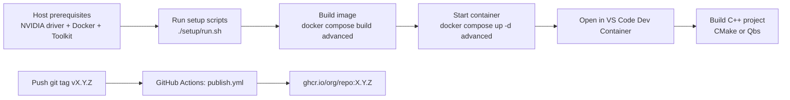

# AI DevBox (Docker + NVIDIA + VS Code)

This repository provides a GPU-enabled C++ development stack based on NVIDIA DeepStream, with:

- One unified `advanced` service (C++ dev stack with optional ZED SDK and OpenGL GUI tools via build args)
- ZED SDK 5.x support with Ubuntu-version-aware installer (auto-detected at build time)
- Project root mapped from host <project> to container `/root/project`
- C++ source folder mapped from host `<project>/source` to container `/root/project/source`
- VS Code Dev Container support (`.devcontainer/devcontainer.json`)
- Pre-installed C++ AI and Computer Vision libraries: LibTorch, Eigen, and OpenCV
- Build system support for both CMake and Qbs projects
- C++ debugging support (`gdb`, `gdbserver`, `SYS_PTRACE`, `seccomp:unconfined`)
- C++ symbol demangling enabled by default in GDB
- Shared `ccache` volume across containers

## Table of contents

- [Workflow diagram](#workflow-diagram)
- [1. Prerequisites](#1-prerequisites)
- [2. Project layout expectation](#2-project-layout-expectation)
- [3. Build images](#3-build-images)
- [3.1 Dependency matrix](#31-dependency-matrix)
- [4. Launch container](#4-launch-container)
- [4.1 Compose (recommended)](#41-compose-recommended)
- [4.2 Equivalent `docker run`](#42-equivalent-docker-run)
- [4.3 Numbered project launcher script](#43-numbered-project-launcher-script)
- [5. ZED SDK support](#5-zed-sdk-support)
- [5.1 Build with ZED SDK](#51-build-with-zed-sdk)
- [5.2 Physical camera (USB)](#52-physical-camera-usb)
- [5.3 GUI tools (OpenGL)](#53-gui-tools-opengl)
- [6. Use from VS Code](#6-use-from-vs-code)
- [7. Debugging notes](#7-debugging-notes)
- [8. Build systems (CMake + Qbs)](#8-build-systems-cmake--qbs)
- [9. ccache (shared across containers)](#9-ccache-shared-across-containers)
- [10. Common commands](#10-common-commands)
- [11. Container runtime info helper](#11-container-runtime-info-helper)
- [12. Publishing images to GHCR](#12-publishing-images-to-ghcr)
- [13. Notes](#13-notes)

---

## Workflow diagram



---

## 1. Prerequisites

- Linux host with NVIDIA GPU
- Docker Engine + Docker Compose plugin
- NVIDIA driver installed on host
- NVIDIA Container Toolkit installed and configured for Docker

### Optional helper scripts

You can run the scripts in `setup/`:

- `setup/01_nvidia_drivers.sh`
- `setup/02_docker.sh`
- `setup/03_nvidia_container_toolkit.sh`
- `setup/04_vscode_extensions.sh`
- `setup/05_shellcheck.sh`

Or run them in order via the root helper:

- `./setup/run.sh`

Example:

```bash
chmod +x setup/run.sh setup/*.sh
./setup/run.sh
./setup/run.sh --dry-run

# or run steps manually
chmod +x setup/*.sh
./setup/01_nvidia_drivers.sh
# reboot if you installed/updated drivers
./setup/02_docker.sh
./setup/03_nvidia_container_toolkit.sh
./setup/04_vscode_extensions.sh
./setup/05_shellcheck.sh
```

Verify GPU inside Docker:

```bash
docker run --rm --gpus all ubuntu:22.04 nvidia-smi
```

---

## 2. Project layout expectation

Your repository root should be:

```text
./
```

It is mounted into the container at:

```text
/root/project
```

Your C++ sources should typically be placed in:

```text
./source
```

Inside the container, this path is:

```text
/root/project/source
```

---

## 3. Build images

Use the helper script (recommended):

```bash
bash ./container/compose-build.sh
```

It wraps `docker compose build` from the repository root and accepts optional flags such as `--no-cache` and `--pull`.

Build `advanced` (current active/default dev target):

```bash
docker compose build advanced
```

For reproducible builds, set a pinned base image reference and enable checksum enforcement in `.env` before building:

```bash
cp .env.example .env
echo 'ADVANCED_BASE_IMAGE_URL=nvcr.io/nvidia/deepstream:9.0-triton-multiarch@sha256:<digest>' >> .env
echo 'ADVANCED_GCC_VERSION=14' >> .env
echo 'ADVANCED_CMAKE_VERSION=3.31.0' >> .env
echo 'REQUIRE_TORCH_SHA256=1' >> .env
```

Note: there is no separate `UBUNTU_VERSION` setting. The Ubuntu release inside the container comes from the selected base image.

Examples with the helper:

```bash
bash ./container/compose-build.sh advanced --pull
bash ./container/compose-build.sh advanced --no-cache
```

### 3.1 Dependency matrix

| Component | advanced | Source |
| --- | --- | --- |
| Base image | `nvcr.io/nvidia/deepstream:9.0-triton-multiarch` | `ADVANCED_BASE_IMAGE_URL` |
| Ubuntu | 24.04 | from base image |
| CUDA | 12.6 | from base image |
| GCC | `14` | `ADVANCED_GCC_VERSION` |
| CMake | `3.31.0` | `ADVANCED_CMAKE_VERSION` |
| LibTorch | `2.5.1+cu121` | PyTorch download URL |
| Eigen | `5.0.0` | Git clone by tag |
| OpenCV | `libopencv-dev` | Ubuntu package |
| Qbs | distro package | Ubuntu package |
| ZED SDK | optional — `INSTALL_ZED_SDK=1` | `ZED_SDK_MAJOR` / `ZED_SDK_MINOR` |
| ZED GL libs | optional — `ZED_GL=1` (requires ZED SDK) | `ZED_GL` build arg |
| ccache size | `20G` | `CCACHE_MAXSIZE` |

---

## 4. Launch container

### 4.1 Compose (recommended)

Use the helper script (recommended):

```bash
bash ./container/compose-up.sh
```

It computes `(cores - 1)` (minimum `1`) and exports:

- `CMAKE_BUILD_PARALLEL_LEVEL`
- `AI_DEVBOX_BUILD_JOBS`
- `CCACHE_MAXSIZE` remains configurable and defaults to `20G`

Then it runs `docker compose up -d advanced`.

You can select another service:

```bash
bash ./container/compose-up.sh advanced
```

Manual equivalent:

Compute conservative build parallelism (cores minus one, minimum one), then launch:

```bash
CORES="$(getconf _NPROCESSORS_ONLN 2>/dev/null || nproc 2>/dev/null || echo 1)"
CMAKE_BUILD_PARALLEL_LEVEL=$((CORES - 1))
if [[ "${CMAKE_BUILD_PARALLEL_LEVEL}" -lt 1 ]]; then CMAKE_BUILD_PARALLEL_LEVEL=1; fi
AI_DEVBOX_BUILD_JOBS="${CMAKE_BUILD_PARALLEL_LEVEL}"

export CMAKE_BUILD_PARALLEL_LEVEL AI_DEVBOX_BUILD_JOBS
docker compose up -d advanced
```

Quick override example:

```bash
CMAKE_BUILD_PARALLEL_LEVEL=6 AI_DEVBOX_BUILD_JOBS=6 CCACHE_MAXSIZE=40G docker compose up -d advanced
```

Open shell in running container:

```bash
docker exec -it ai-devbox-advanced /bin/bash
```

Stop it:

```bash
bash ./container/compose-stop.sh
```

Remove it:

```bash
bash ./container/compose-rm.sh
```

### 4.2 Equivalent `docker run`

If you prefer direct `docker run`, equivalent behavior is:

```bash
docker run -d \
  --name ai-devbox-advanced \
  --restart unless-stopped \
  --gpus all \
  -e NVIDIA_VISIBLE_DEVICES=all \
  -e CMAKE_BUILD_PARALLEL_LEVEL="${CMAKE_BUILD_PARALLEL_LEVEL:-1}" \
  -e AI_DEVBOX_BUILD_JOBS="${AI_DEVBOX_BUILD_JOBS:-1}" \
  -e CCACHE_MAXSIZE="${CCACHE_MAXSIZE:-20G}" \
  -v "$PWD:/root/project" \
  -v ai-devbox-ccache:/root/.ccache \
  ai-devbox:advanced
```

Run this command from the repository root.

### 4.3 Numbered project launcher script

Use `container/start.sh` when you want multiple parallel checkouts of the same repo
like `~/Development/MyProject1`, `~/Development/MyProject2`, etc.

Make it executable:

```bash
chmod +x ./container/start.sh
```

Run it with `PROJECT_PREFIX` and an optional numeric suffix:

```bash
PROJECT_PREFIX=~/Development/MyProject ./container/start.sh 10
```

If no number is provided, it defaults to `1`:

```bash
PROJECT_PREFIX=~/Development/MyProject ./container/start.sh
```

This starts container `MyProject10` and maps:

- host: `~/Development/MyProject10`
- container: `/root/project`

If `PROJECT_PREFIX` is not set, the script uses your current directory as host path.

- Container name base is the current folder name.
- If the folder name ends with digits (for example `MyProject12`), that suffix is used.
- If the folder name has no trailing digits, suffix `1` is used.

Examples:

```bash
cd ~/Development/MyProject12
./container/start.sh
# starts container MyProject12 and maps ~/Development/MyProject12 -> /root/project

cd ~/Development/MyProject
./container/start.sh
# starts container MyProject1 and maps ~/Development/MyProject -> /root/project
```

Inside that container, C++ sources in the host checkout's `source/` folder are available at `/root/project/source`.

The launcher also sets conservative defaults for build parallelism to keep GUI hosts responsive:

- `CMAKE_BUILD_PARALLEL_LEVEL=(host cores - 1)`
- `AI_DEVBOX_BUILD_JOBS=(host cores - 1)`

Both values are clamped to a minimum of `1`, and can be overridden before launching:

```bash
CMAKE_BUILD_PARALLEL_LEVEL=6 AI_DEVBOX_BUILD_JOBS=6 CCACHE_MAXSIZE=40G PROJECT_PREFIX=~/Development/MyProject ./container/start.sh 10
```

---

## 5. ZED SDK support

ZED SDK integration is built into the single `advanced` service and controlled entirely by
build-time ARGs. The container always runs with `privileged: true`, full driver capabilities,
X11 forwarding, and the `zed-resources` volume — all of which are safe no-ops when ZED SDK
is not installed.

| Build ARG | Default | Effect |
| --- | --- | --- |
| `INSTALL_ZED_SDK` | `0` | `1` installs ZED SDK 5.x into the image |
| `ZED_GL` | `0` | `1` adds OpenGL/GUI libs (ZED Explorer, Depth Viewer); requires `INSTALL_ZED_SDK=1` |
| `ZED_SDK_MAJOR` | `5` | SDK major version |
| `ZED_SDK_MINOR` | `2` | SDK minor version |
| `ZED_CUDA_MAJOR` | `12` | CUDA major used by the installer |

### 5.1 Build with ZED SDK

Set ZED variables in `.env` (or rely on the defaults from `.env.example`):

```bash
cp .env.example .env
# defaults: ZED_SDK_MAJOR=5, ZED_SDK_MINOR=2, ZED_CUDA_MAJOR=12
```

Build — plain C++ stack (no ZED SDK):

```bash
bash ./container/compose-build.sh advanced
```

Build with ZED SDK (headless, no GUI tools):

```bash
INSTALL_ZED_SDK=1 bash ./container/compose-build.sh advanced
```

Build with ZED SDK + OpenGL GUI tools:

```bash
INSTALL_ZED_SDK=1 ZED_GL=1 bash ./container/compose-build.sh advanced
```

Run:

```bash
bash ./container/compose-up.sh advanced
```

Open a shell:

```bash
docker exec -it ai-devbox-advanced /bin/bash
```

Using `container/start.sh`:

```bash
PROJECT_PREFIX=~/Development/MyProject ./container/start.sh 1
```

### 5.2 Physical camera (USB)

The `advanced` container runs with `privileged: true`, which passes all host USB devices
into the container. Verify the camera is seen inside the container:

```bash
lsusb -d 2b03:
```

A persistent named volume stores ZED AI models so they survive container recreation and
avoid re-downloading and re-optimizing on every startup:

- Volume name: `ai-devbox-zed-resources`
- Mounted at: `/usr/local/zed/resources`

To pre-populate models:

```bash
docker exec -it ai-devbox-advanced /usr/local/zed/tools/ZED_Diagnostic
```

### 5.3 GUI tools (OpenGL)

When the image is built with `ZED_GL=1`, OpenGL libraries and ZED Explorer / ZED Depth Viewer
prerequisites are included. Before starting the container, grant X11 access:

```bash
xhost +si:localuser:root
```

Then launch ZED Explorer from inside the container:

```bash
docker exec -it ai-devbox-advanced /usr/local/zed/tools/ZED\ Explorer
```

To restore X11 access restrictions after your session:

```bash
xhost -si:localuser:root
```

---

## 6. Use from VS Code

1. Open this repository in VS Code.
2. Run: **Dev Containers: Rebuild and Reopen in Container**.
3. VS Code attaches to service `advanced` with workspace folder `/root/project`.

Dev Containers also loads `.devcontainer/docker-compose.devcontainer.yml`, which disables
container restart policy and healthcheck for the `advanced` service during editor attach.
This avoids reconnect loops and extension-install stalls in the remote container session.

Recommended extensions are configured automatically:

- `ms-vscode.cpptools`
- `ms-vscode.cmake-tools`
- `bierner.markdown-mermaid`
- `qbs-community.qbs-tools`
- `xaver.clang-format`

---

## 7. Debugging notes

This stack is preconfigured for container debugging:

- `gdb` and `gdbserver` installed in image
- `SYS_PTRACE` capability enabled
- `seccomp:unconfined` enabled
- GDB demangling defaults configured in `/root/.gdbinit`

So C++ symbols appear demangled during debugging sessions.

---

## 8. Build systems (CMake + Qbs)

This image supports both CMake- and Qbs-based C++ projects.

For interactive desktop use, prefer one less than total cores:

```bash
CORES="$(getconf _NPROCESSORS_ONLN 2>/dev/null || nproc 2>/dev/null || echo 1)"
JOBS=$((CORES - 1))
if [[ "${JOBS}" -lt 1 ]]; then JOBS=1; fi
```

If you start the container with `./container/start.sh`, this is already preconfigured via
`CMAKE_BUILD_PARALLEL_LEVEL` and `AI_DEVBOX_BUILD_JOBS`.

Check tool versions:

```bash
cmake --version
qbs --version
clang-format --version
```

### CMake quick start

Configure and build a Debug target:

```bash
cd /root/project
cmake -S . -B build -DCMAKE_BUILD_TYPE=Debug
cmake --build build --parallel "${CMAKE_BUILD_PARALLEL_LEVEL:-$JOBS}"
```

Release build:

```bash
cmake -S . -B build-release -DCMAKE_BUILD_TYPE=Release
cmake --build build-release --parallel "${CMAKE_BUILD_PARALLEL_LEVEL:-$JOBS}"
```

### Qbs quick start

Create/update a profile (example using GCC):

```bash
qbs setup-toolchains --type gcc /usr/bin/g++ gcc
```

Configure and build a Debug target:

```bash
cd /root/project
qbs config defaultProfile gcc
qbs build -f your-project.qbs profile:gcc config:debug --jobs "${AI_DEVBOX_BUILD_JOBS:-$JOBS}"
```

Release build:

```bash
qbs build -f your-project.qbs profile:gcc config:release --jobs "${AI_DEVBOX_BUILD_JOBS:-$JOBS}"
```

---

## 9. ccache (shared across containers)

A named Docker volume is used:

- Volume name: `ai-devbox-ccache`
- Mounted at `/root/.ccache`

This means cache survives container recreation and is shared by services using the same volume.

Check cache stats:

```bash
ccache -s
```

Default max size is `20G`. Override it with `CCACHE_MAXSIZE` in `.env`, for example `CCACHE_MAXSIZE=40G`.

Clear cache if needed:

```bash
ccache -C
```

---

## 10. Common commands

Bring up advanced service:

```bash
bash ./container/compose-up.sh
```

Bring up zed service:

```bash
bash ./container/compose-up.sh zed
```

Rebuild advanced image:

```bash
bash ./container/compose-build.sh advanced --no-cache
```

View logs:

```bash
docker compose logs -f advanced
```

Stop advanced service:

```bash
bash ./container/compose-stop.sh
```

Remove advanced service:

```bash
bash ./container/compose-rm.sh
```

Stop all services:

```bash
docker compose down
```

Stop services and remove shared cache volume:

```bash
docker compose down -v
```

---

## 11. Container runtime info helper

A helper script is available to detect container runtime and print container/image metadata:

```bash
./container/info.sh
```

Output includes:

- container name
- image name
- base image reference
- GCC, CMake, and Eigen versions
- ZED SDK version and GL flag
- ccache max size

The metadata is embedded during image build via OCI labels and a small release file in the image, so no manual `.env` bookkeeping is required.

---

## 12. Publishing images to GHCR

The workflow `.github/workflows/publish.yml` automatically builds and pushes the image
(with ZED SDK always enabled) to the **GitHub Container Registry (GHCR)**.

### What gets built

| Build arg | Value used in CI |
| --- | --- |
| `BASE_IMAGE_URL` | `nvcr.io/nvidia/deepstream:9.0-triton-multiarch` |
| `GCC_VERSION` | `14` |
| `CMAKE_VERSION` | `3.31.0` |
| `TORCH_URL` | LibTorch `2.5.1+cu121` (pre-built, cxx11 ABI) |
| `REQUIRE_TORCH_SHA256` | `0` |
| `EIGEN_VERSION` | `5.0.0` |
| `INSTALL_ZED_SDK` | `1` (always enabled) |
| `ZED_SDK_MAJOR` | `5` |
| `ZED_SDK_MINOR` | `2` |
| `ZED_CUDA_MAJOR` | `12` |
| `ZED_GL` | `0` (headless; no OpenGL GUI tools) |

### Image tags

For a tag push of `v1.2.3`, the following tags are published to GHCR:

```
ghcr.io/<org>/<repo>:1.2.3
ghcr.io/<org>/<repo>:1.2
ghcr.io/<org>/<repo>:latest
```

### Triggers

| Event | Behaviour |
| --- | --- |
| `git push` of a `v*.*.*` tag | Builds and pushes, tags as semver + `latest` |
| Manual `workflow_dispatch` | Builds and pushes, tagged with the custom label input (default: `manual`) |

### Publish a new release

```bash
git tag v1.0.0
git push origin v1.0.0
```

Then watch the **Actions → Publish** workflow in the GitHub UI.

### Pull the published image

```bash
docker pull ghcr.io/<org>/<repo>:latest
```

For GPU use:

```bash
docker run --rm --gpus all ghcr.io/<org>/<repo>:latest nvidia-smi
```

### Authentication

No extra secrets are required. The workflow uses the built-in `GITHUB_TOKEN` which is
automatically available in every GitHub Actions run. For public repositories, anyone can
pull the image without authentication.

### Build cache

The workflow uses **GitHub Actions cache** (`type=gha`) to store Docker layer cache between
runs. This is free (shared 10 GB quota per repository). On a cache hit, only changed layers
are rebuilt — significantly reducing build time after the first successful run.

> **Note:** The ZED SDK installer is ~2–3 GB and is downloaded fresh if its layer is
> invalidated. Avoid changing `ZED_SDK_MAJOR` / `ZED_SDK_MINOR` / `ZED_CUDA_MAJOR`
> unnecessarily to preserve the cached layer.

---

## 13. Notes

- Container working directory is `/root/project`.
- If NVIDIA runtime fails, recheck driver/toolkit installation and restart Docker.
- If image tags (DeepStream/LibTorch) change upstream, update build args in `docker-compose.yml`.
- `setup/01_nvidia_drivers.sh` accepts `NVIDIA_DRIVER_VERSION` and `NVIDIA_DRIVER_FLAVOR` (`open` or `proprietary`).
- ZED SDK Ubuntu version is auto-detected from `/etc/os-release` at build time; do not pass `UBUNTU_RELEASE_YEAR` manually.
- `cu121` LibTorch is compatible with any CUDA 12.x runtime. If a CUDA 13.x base image is ever used, update `TORCH_URL` to a `cu130` build.
- ZED AI models are stored in the `ai-devbox-zed-resources` volume at `/usr/local/zed/resources` and survive container recreation.
